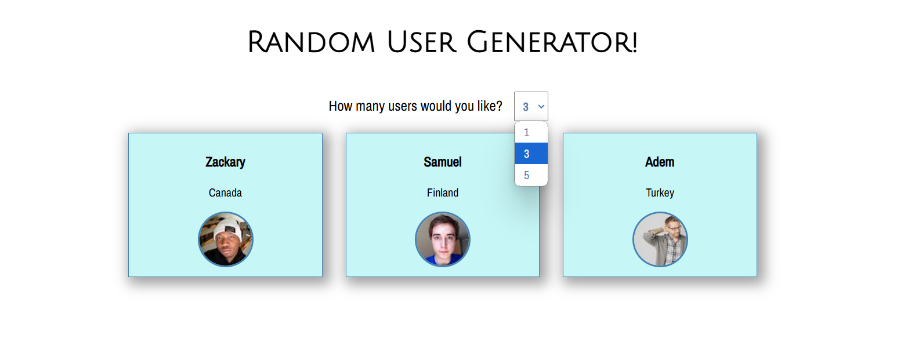

# User-Generator

- [Overview](#overview)
  - [Screenshot](#screenshot)
  - [Links](#links)
- [My process](#my-process)
  - [Built with](#built-with)
  - [What I learned](#what-i-learned)
  - [Continued development](#continued-development)
  - [Useful resources](#useful-resources)
- [Author](#author)
- [Acknowledgments](#acknowledgments)

## Overview
- User selects the number of IDs for the program to generate nfrom a drop down menu. The photo and ID information are randomly chosen and displayed. Click away!

### Screenshot

### Links
- Solution URL:
 https://github.com/Dev-Wy/User-Generator/
- Live Site URL:
 https://dev-wy.github.io/User-Generator/

## My Process
### Built with
- JavaScript
- Manipulate the DOM

### What I learned
- I learned how to use a selector option and enhanced my JavaScript skills. I also became familiar randomizing within JS functions.

### Continued development
- I would like to connect this to an API to select books from a list of genres choices. It would be an entertaing way for a reader to select their next book.

### Useful Resources: 
- I love W3C School's validation services. 
- https://validator.w3.org/   
- https://jigsaw.w3.org/css-validator/

## Author
- Jake Wyant
- Portfolio: https://dev-wy.github.io/Portfolio/
- https://forum.freecodecamp.org/u/dev-wy/summary

## Acknowledgments
- W3C for their resources. 
- Special thanks to Skillcrush for giving me the foundation to build on.
